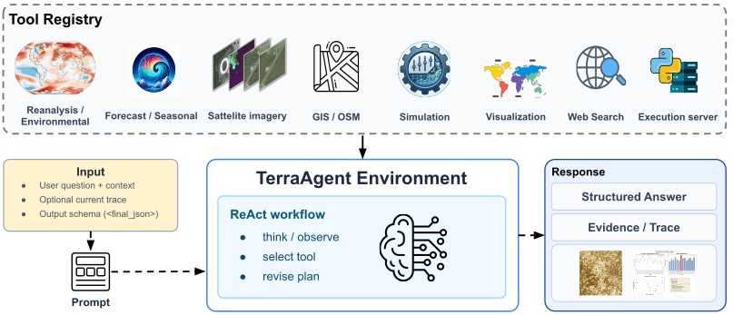
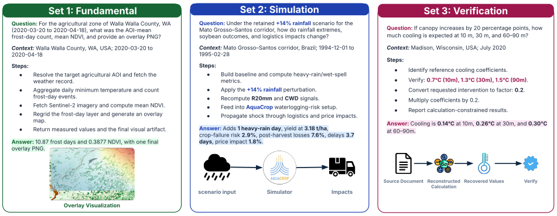

# TerraBench

TerraBench is a research benchmark for evaluating whether agents can reason over heterogeneous Earth-system data. TerraAgent is the companion agent/tool-execution framework used to run benchmark workflows and record structured traces.

## Repository Metadata

- Repository: [Takerdat23/TerraBench](https://github.com/Takerdat23/TerraBench)
- Python packages: `terrabench`, `terra_agent`
- License: MIT

## Overview Figures





## What Is TerraBench?

TerraBench contains benchmark schemas, data loaders, trace utilities, evaluation metrics, and reporting tools. It is exposed as the `terrabench` Python package.

The benchmark tracks are:

- Fundamentals
- Simulator-Grounded
- Document-Grounded Verification

## What Is TerraAgent?

TerraAgent is the agent execution layer. It provides a common tool interface, plugin-like tool registry, mock/dry-run execution modes, and trace output. It is exposed as the `terra_agent` Python package.

## Repository Structure

```text
terrabench/          benchmark schemas, loaders, traces, metrics, registries
terra_agent/         TerraAgent runner, full-agent runtime, prompts, and tools
terra_agent/code_agent/
                     InterCode-backed code-agent FastAPI service
configs/             default paths, tools, and evaluation settings
scripts/             thin CLI wrappers
examples/            sanitized minimal benchmark item
tests/               unit and smoke tests
docs/                architecture, schema, metrics, and release docs
data/sample/         tiny public sample data only
outputs/             local run outputs, ignored except README/.gitkeep
evaluation_results/  sample metric files
archive/             internal legacy inventory notes
```

## Installation

```bash
git clone https://github.com/Takerdat23/TerraBench.git
cd TerraBench
conda create -n terrabench python=3.10
conda activate terrabench
pip install -e .
```

For the fuller conda environment:

```bash
conda env create -f environment.yml
conda activate terrabench
pip install -e .
```

## Quickstart

```bash
python scripts/run_smoke_test.py
python scripts/run_agent.py --item examples/minimal_item --out outputs/example_agent --mock-tools
python scripts/run_evaluation.py --pred examples/minimal_item/prediction_example.json --gt examples/minimal_item/number_ground_truth.json --out outputs/example_eval
```

## Code Agent Service

The InterCode-backed code agent lives in `terra_agent/code_agent/`. Build its
Docker sandbox once, then start the FastAPI service:

```bash
cd terra_agent/code_agent
bash setup.sh
cd ../..
scripts/start_code_agent.sh
```

The TerraAgent tool registry exposes this endpoint as `code_agent`. See
[docs/code_agent.md](docs/code_agent.md) for request examples and operational
settings.

## Full Agent Runtime

The ClimateAgent-derived full agent is packaged under `terra_agent/full_agent/`.
Its domain tools live under `terra_agent/tools/climate/`, forecast helpers under
`terra_agent/forecast_models/`, and prompts under `terra_agent/prompts/full_agent/`.
Datasets, logs, keys, weights, and external simulator installs stay out of the repo.

```bash
python scripts/run_full_agent.py \
  --model-provider openai \
  --user-request "Your climate or Earth-system request here" \
  --agent-dest outputs/full_agent_run
```

See [docs/full_agent_run.md](docs/full_agent_run.md) for the step-by-step flow
from starting the code agent to running a full agent request.

## Running Evaluation

```bash
python scripts/run_evaluation.py \
  --pred examples/minimal_item/prediction_example.json \
  --gt examples/minimal_item/number_ground_truth.json \
  --trace examples/minimal_item/Main_trace.json \
  --out outputs/example_eval
```

## Tool Registry Overview

Tools implement `terra_agent.tools.base.BaseTool` and register through `terra_agent.tools.registry.register_tool`. New tools can be added without editing the agent runner or benchmark evaluator.

## External Dependencies And API Credentials

Copy `.env.example` to `.env` and add user-provided credentials only when needed:

```bash
cp .env.example .env
```

External services and official simulators are optional for tests and smoke runs. Use `--mock-tools` for public smoke tests that require no credentials.

## Reproducing Paper Metrics

From released metric files:

```bash
python scripts/generate_report.py --metrics evaluation_results/metric_scores_sample --out outputs/reports
python scripts/run_bootstrap.py --metrics evaluation_results/metric_scores_sample --out outputs/bootstrap
```

Full paper reproduction may require separately hosted traces, external data-service credentials, and configured simulator executables.

## Citation

This repository builds on InterCode and AgentScope. Please cite these upstream
works when using the code-agent or agent-framework components:

```bibtex
@misc{yang2023intercode,
  title = {InterCode: Standardizing and Benchmarking Interactive Coding with Execution Feedback},
  author = {John Yang and Akshara Prabhakar and Karthik Narasimhan and Shunyu Yao},
  year = {2023},
  eprint = {2306.14898},
  archivePrefix = {arXiv},
  primaryClass = {cs.CL}
}

@article{agentscope_v1,
  title = {AgentScope 1.0: A Developer-Centric Framework for Building Agentic Applications},
  author = {Dawei Gao and Zitao Li and Yuexiang Xie and Weirui Kuang and Liuyi Yao and Bingchen Qian and Zhijian Ma and Yue Cui and Haohao Luo and Shen Li and Lu Yi and Yi Yu and Shiqi He and Zhiling Luo and Wenmeng Zhou and Zhicheng Zhang and Xuguang He and Ziqian Chen and Weikai Liao and Farruh Isakulovich Kushnazarov and Yaliang Li and Bolin Ding and Jingren Zhou},
  journal = {CoRR},
  volume = {abs/2508.16279},
  year = {2025}
}
```

## License

TerraBench is released under the MIT License. See [LICENSE](LICENSE).

## Known Limitations

- The included example is synthetic and intentionally small.
- Official simulator engines are not bundled.
- Mock TerraAgent execution is provided for tests and public smoke runs.
- Full benchmark data access and final artifact-hosting URLs require a human release decision.
